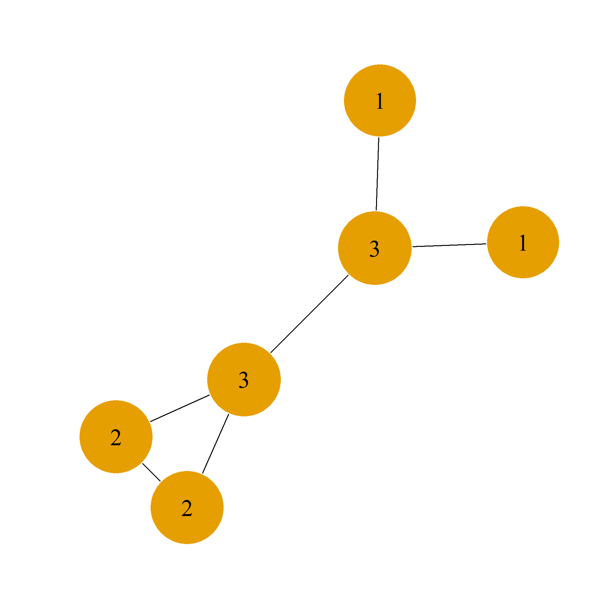
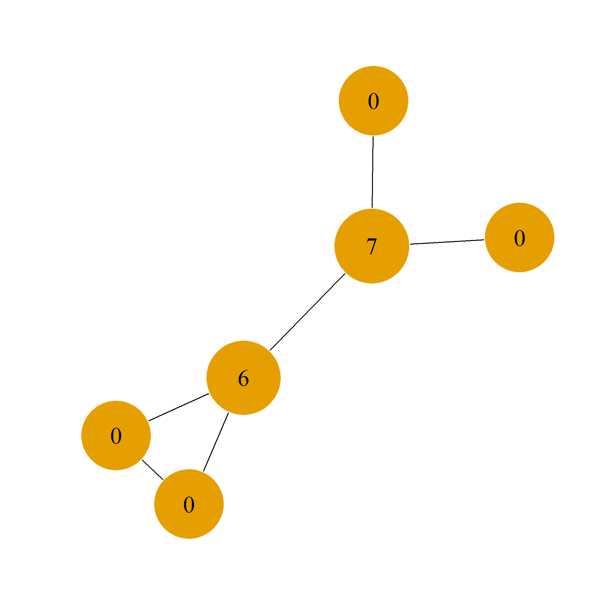
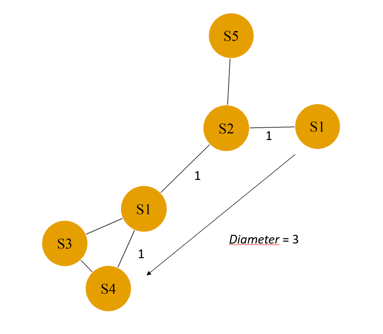
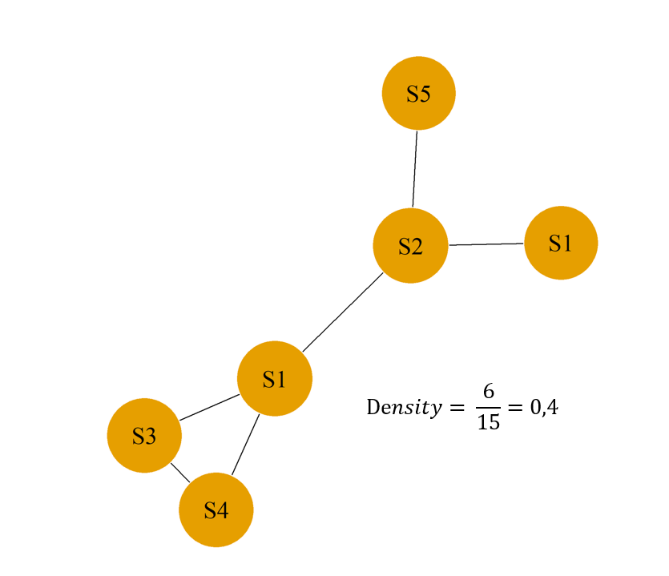
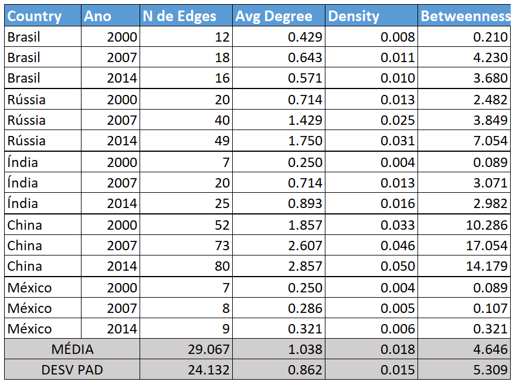
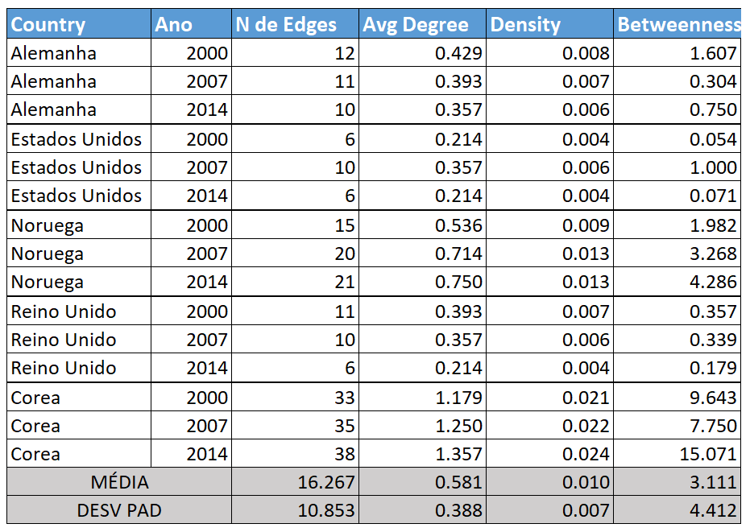

```{r error=FALSE, message="", warning=FALSE, include=FALSE}
library(pander)
library(networkD3)
library(igraph)
library(readxl)
library(dplyr)
library(sna)
library(xtable)
library(reshape)
library(ggplot2)
library(data.table)
library(network)
library(RColorBrewer)
library(gridExtra)  
library(plotly)
library(sqldf)
library(png)
library(knitr)
library(sqldf)
```

## Sumário {.build}

* Insumo-Produto e *Network Analysis*

* Modelos Norte-Sul

* Teoria dos *Graphos*

* Resultados


***
## Matrizes Insumo-Produto

```{r echo = FALSE, fig.align='center', error=FALSE, message="", warning=FALSE}
library(igraph)
M  <-  matrix( c(    0,	 96,	 48,	15,	     0,	    0,
                   588,	  0,	  0,	 0,	   525,	   25,
                   291,	  0,	  0,	59,	     0,	    0,
                     0,   0,	 20,     0,	     0,	    0,
                     0,	154,	  0,     0,	     0,	    0,
                     0,	  9,	  0,	 0,	     0,	    0),nrow=6,ncol=6,byrow = TRUE)

dimnames(M)  <-  list( c("Agric", "Alime", "IndTr", "Eletr", "Petro", "Transp" ), c("Agric", "Alime", "IndTr", "Eletr", "Petro", "Transp" ))

pander(M) 
```

## O que são Networks Analysis?  

 * É um método matemático e gráfico que permite estudar sistemas constituídos de pontos (agentes) conectados (links) que geram macro e micro estruturas próprias. Tais estruturas evoluem criando e destruindos conexões, produzindo dinâmicas complexas que de outra forma não poderiam ser estudadas (Jackson, 2008);  
 
 * Networks são observadas em importantes dimensões da economia e da sociedade. Relações entre países, cidades, firmas, consumidores, sistema financeiro e muitos outros, formam redes de alta complexidade por onde fluem informações, mercadorias e valores monetários.


## Transformando Matrizes Insumo-Produto em Networks Interativas
```{r echo = FALSE, fig.align='center', error=FALSE, message="", warning=FALSE}
# Load package
library(networkD3)

# Create fake data
src    <- c("Agric", "Agric", "Agric", "Alime", "Alime", "IndTr", "IndTr", "Eletr", "Petro")
target <- c("Alime", "IndTr", "Eletr", "Petro", "Transp", "Agric", "IndTr", "IndTr", "Alime")
networkData <- data.frame(src, target)

# Plot
simpleNetwork(networkData, fontSize = 12, opacity = 0.8,  charge = -70, linkDistance = 60, zoom = T )
```


## Modelos Norte-Sul

#### **1. Estruturalismo da CEPAL** (Singer,1950; Prebisch, 1950)
  - Relação Centro-Periferia;
  
#### **2. Modelos Norte-Sul** (Krugman, 1979 e Findlay 1980)  
  - Inovação e Indústria;
  
#### **3. A escolha dos países:**
  - Norte: EUA, Reino Unido, Alemanha, Noruega e Coreia; 
  - Sul: Brasil, Rússia, Índia, China e México.  

## A pesquisa

#### **1. Matriz Insumo-Produto com 56 setores;**  
 - *World Input-Output Database* (Timmer et al., 2015)
 
#### **2. Algoritmo desenvolvido em *R*:**  

 -  *igraph* ;  *NetworkD3* ;  *dplyr*
  
#### **3. Aplicação de estatísticas descritivas da teoria dos graphos:**  

 -  *Degree*
 -  *Betweenness*
 -  *Diameter*
 -  *Density*
  
#### **4. Thresholds:**  
 - Filtros limitadores de 5%, 10% e 15%.

***
### Necessidade de filtros: Excesso de conexões inexpressivas.


##

### **Degree:**  <br />

- Número de links de um setor: $x_{i} = \sum_i a_{j,i}$ <br />

 

## 
### **Betweenness:**  <br />

- Mede a extensão em que um vértice se encontra em trajetos entre outros vértices: $BC(i) = \sum {w,j} (\frac{\sigma{wj(i)}}{\sigma{wj}})$.

 

## 
### **Diameter:**  <br />

- Mede o comprimento de um grapho contando o número de arestas no caminho mais curto entre os vértices mais distantes: $Diameter = max_{i,j}{d(i,j)}$, onde $i,j$ são setores da network.


 


## 
### **Density:**  <br />

- Descreve a proporção de conexões em potencial em uma rede que são conexões reais. $Density = \frac{Conexões Existentes}{Conexões Potenciais}$

 


## Conclusões - Países do Sul



## Conclusões - Países do Norte




## Networks - Países do Sul

<div style="position: absolute;  top: 11%; right: 8%; ">
    Índia
</div>


<div style="position: absolute;  top: 11%; right: 41%; ">
    Rússia
</div>


<div style="position: absolute;  top: 11%; right: 72%; ">
    Brasil
</div>


<div style="position: absolute;  top: 53%; right: 63%; ">
    China
</div>


<div style="position: absolute;  top: 53%; right: 25%; ">
    México
</div>


## Networks - Países do Norte

<div style="position: absolute;  top: 11%; right: 8%; ">
    Alemanha
</div>


<div style="position: absolute;  top: 11%; right: 41%; ">
    EUA
</div>


<div style="position: absolute;  top: 11%; right: 72%; ">
    Reino Unido
</div>


<div style="position: absolute;  top: 53%; right: 63%; ">
    Coreia
</div>


<div style="position: absolute;  top: 53%; right: 25%; ">
    Noruega
</div>


## Conclusões

 * China(Sul) e Coreia(Norte) são as economias mais diversificadas analisadas;
 * Países do Sul parecem estar em uma tendência a diversificação econômica;
 * Em contra partida, os países do Norte em geral, parecem estar diminuindo a diversificação econômica; 
 * Na maioria dos países, os setores dominantes permaneceram como centrais durante toda a série;  
 * Validação do método de análise de *Networks* como ferramenta de análise econômica;  
 * Aplicação da metodologia para análise da *Network* mundial, com todos os países.
 

##
Referências:

* Timmer, M. P. et al. An Illustrated User Guide to the World Input-Output Database: The Case of Global Automotive Production. Review of International Economics, v. 23,n. 3, p. 575{605, 2015. ISSN 14679396.

* Singer, H. W. The Distribution of Gains between Investing and Borrowing Countries.
The American Economic Review, v. 40, n. 2, p. 473{485, 1950. Disponível em:
hhttps://www.jstor.org/stable/1818065i.

* Prebisch, R. The Economic Development of Latin America and Its Principal Problems.
Unites Nations Publication, v. 50, 1950.

* Jackson, M. O. Social and Economic Networks. [S.l.]: Princeton University Press, 2008.
648 p.

* Krugman, P. A Model of Innovation , Technology Transfer , and the World Distribution
of Income. Journal of Political Economy, v. 87, n. 2, p. 253-266, 1979. Disponível em:
hhttps://www.jstor.org/stable/1832086i.

* Findlay, R. The Terms of Trade and Equilibrium Growth in the World Economy.
American Economic Association, v. 70, n. 3, p. 291-299, 1980. Disponível em:
hhttps://www.jstor.org/stable/1805220i.

***
<div style="position: absolute;  top: 50%; right: 41%; ">
   Obrigado a todos!
</div>